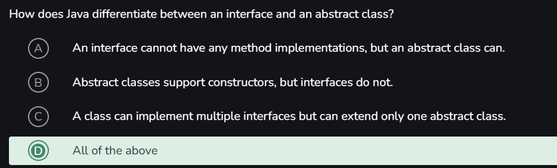

# Main Topics 

- Type casting
- Polymorphism
- Abstraction
- this. vs this()
- constructors and types, constructor chaining
- final, static
- public, private, protected, default // Access Modifier
- Interfaces
- Method overriding vs method overloading
- Error handling : Types of Error 
- Inner classes and types of inner classes
- Wrappers & Primitives
- super()
- Math. other general classes
- Enums
- Generics
- Type Safety issue 
- Collections and Framework
- String vs StringBuilder vs StringBuffer
- Java Multithreading, Sync, Locks
- Volatile vs Atomic

--------------------------------------------------------------------------------
# Variables 

Variables are containers to store data in memory. Each variable has a name, type and value. It is the basic unit of storage in a program. Java has 4 types of variables.

- Local Variables: Declared inside a method, constructor, or block. Accessible only within that block.
- Instance Variables: Declared inside a class but outside any method. Each object of the class has its own copy.
- Static Variables: Declared with the static keyword inside a class. Shared by all objects of the class.
- Final Variables: Declared with final keyword. Value cannot be changed once assigned.

public class Demo {
    public static void main(String[] args) {
        int x = 10;
        {
            int x = 20;
            System.out.println(x);
        }
    }
}
This is called variable overshadowing and can cause and error

----------------------------------------------------------------------------------------
# Methods
Works on method call stack `LIFO`

- Predefined Method
- User-defined Method
    - Instance Methods
    - Static Methods

1. Method Overloading 
2. Method Overriding 

----------------------------------------------------------------------------------------
- hashcode : it returns a unique integer value representing objects memory address. 
----------------------------------------------------------------------------------------

static method vs instance method 
## static method
- Any method that belongs to a class is called static method 
- No object is required to interact with it 
- Since there is no object differentiation there is no need to using this keyword

- A static method in Java is associated with the class, not with any object or instance.
- It can be accessed by all instances of the class, but it does not rely on any specific instance.
- Static methods can access static variables directly without the need for an object.
- They cannot access non-static variables (instance) or methods directly.
    - `Non-static data members or non-static methods cannot be used by static methods, and static methods cannot call non-static methods directly. `
    - `In a static environment, this and super are not allowed to be used.`
- Static methods can be accessed directly in both static and non-static contexts.

## Instance method 
- Are object method can only be used when there is a object of that class
- common for all the objects of the that class not like other variables are new but not static

----------------------------------------------------------------------------------------
# Access Modifier

Define the boundaries of the methods, class and variables
Public - Khulli khitab
Protected - 
Private - Only accessable in that particular class // principle of encapsulation
Default - Only same package

----------------------------------------------------------------------------------------
# Varargs

Note : one method can only have 1 varargs
- The varargs should be declared at the end not in the starting 
- Varargs method can also run without no input 
- whne a varargs is sent it actaully sent as an array no need to mention explicitly 

----------------------------------------------------------------------------------------

- Getter : Accessor method
- Setter : Mutator method 

Jagged array means inappropriate number of rows and cols like one row having 3 cols and other have 2 or 1
like :
1 2
3 4 5
6
7 8 9 10